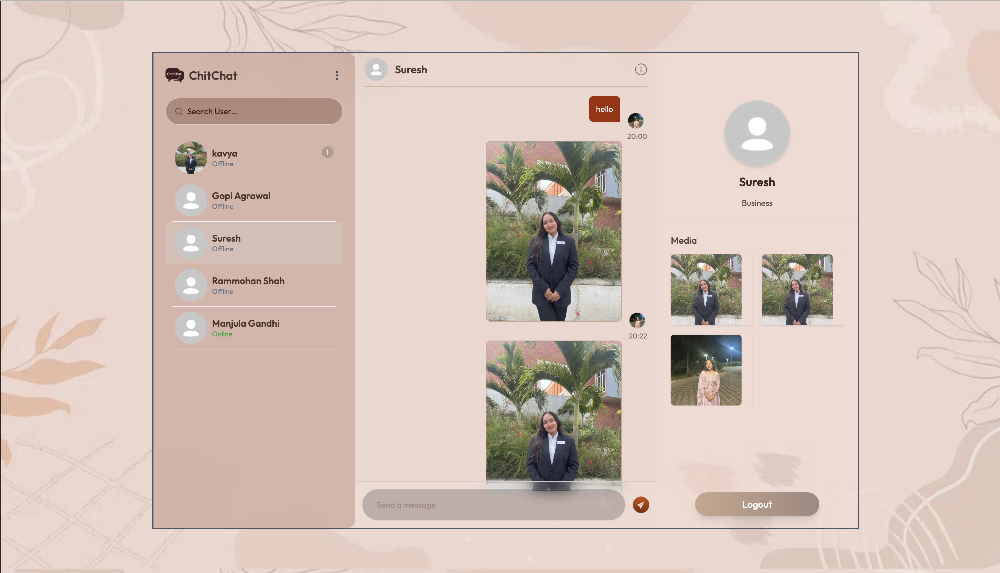
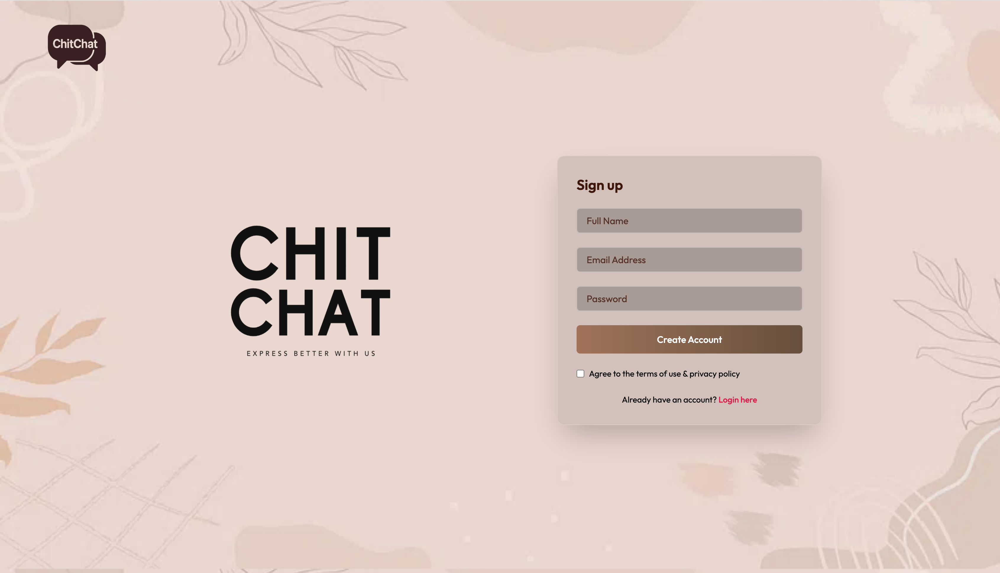
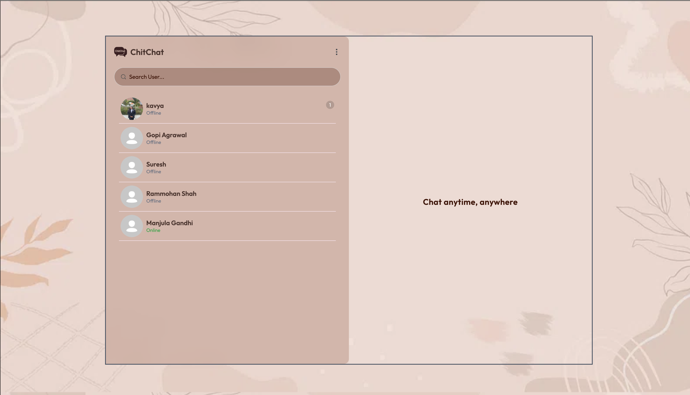
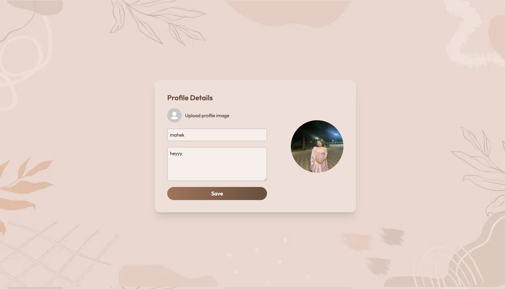

# 💬 ChitChat — Real-Time Messaging Web App

ChitChat is a full-stack real-time chat application that allows users to send text and image messages, view live online/offline status, manage their profiles, and interact in a smooth, modern UI. Built with the **MERN stack** and **Socket.IO**, it ensures fast, responsive, and seamless communication between users.

---

> 🛠️ Built with React.js, Node.js, Express, MongoDB, and Socket.IO

---

## 🌟 Features

- 🔐 User Authentication (Register / Login / Logout)
- 💬 Real-Time One-to-One Messaging
- 📷 Send and Receive Image Messages
- 🟢 Online / Offline Status Indicators
- 🔢 Unread Message Count Badges
- 🖼️ Editable Profile (Picture + Bio)
- 📱 Fully Responsive Interface
- 🔐 JWT-based Secure Sessions

---

## 🛠️ Tech Stack

| Technology      | Purpose                       |
|----------------|-------------------------------|
| React.js        | Frontend UI                   |
| Node.js + Express | Backend API + WebSocket server |
| MongoDB + Mongoose | Database and schema modeling   |
| Socket.IO       | Real-time messaging            |
| Tailwind CSS    | Styling and responsiveness     |
| Multer          | Image uploads                  |
| JWT + bcryptjs  | Authentication & password security |

---

## 📸 Screenshots

| Login Page | Chat Interface | Profile Page |
|------------|----------------|---------------|
|  |  |  |

---

## Author

**Mahek Agrawal**     
GitHub: https://github.com/mahekagrawal16      
LinkedIn: https://linkedin.com/in/mahek-agrawal-503819255   
Email: mahek.suresh.aug2004@gmail.com  
